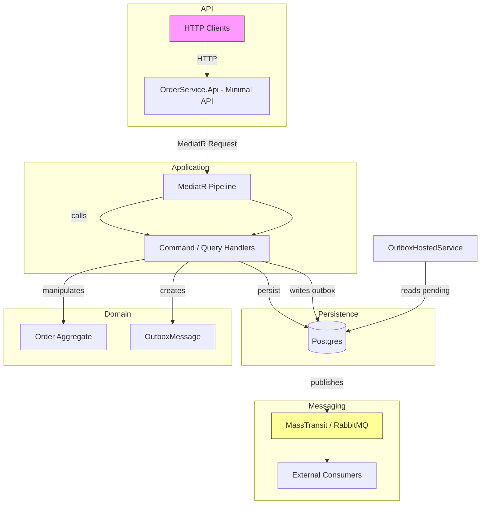
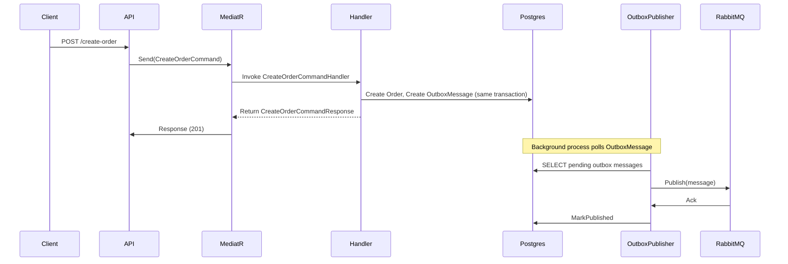

Architecture Overview - OrderProcessingSystem
============================================

This document provides a detailed architecture description of the OrderProcessingSystem sample built with .NET 10. It explains components, data flow, deployment considerations, and includes diagrams (Mermaid + ASCII) showing the runtime interactions and sequence for the primary use-cases.

Goals
- Demonstrate a small, maintainable layered architecture with clear separation of concerns.
- Show integration of MediatR for application behavior, EF Core for persistence, and MassTransit + RabbitMQ for messaging using the Outbox pattern.
- Provide a starting point for extension toward production-ready concerns (observability, retries, secure configuration).

High-level components
- API (OrderService.Api)
  - Minimal ASP.NET Core HTTP API endpoints (MapPost/MapGet) that translate HTTP requests to MediatR commands/queries.
  - Dependency injection registration for MediatR, FluentValidation, EF Core DbContext, MassTransit, and hosted services.
  - Exception handling and ProblemDetails mapping to standardize API error responses.

- Application (OrderService.Application)
  - Implements use-cases as MediatR commands and queries (ICommand/IQuery abstractions).
  - Handlers perform domain operations and interact with repository interfaces (IRepository<T>), returning DTO-like responses.
  - Pipeline behaviors (ValidationBehavior, CommitBehavior) provide cross-cutting concerns: validation and transactional commit.

- Domain (OrderService.Domain)
  - Core entities: Order, OrderItem, OutboxMessage, InboxMessage and domain value/exception types.
  - Business logic, invariants, and state transitions live inside the entities (e.g., AddItem, Cancel, MarkPaymentSucceeded).

- DataAccess (OrderService.DataAccess)
  - OrderServiceEFContext (EF Core) with entity configurations and Npgsql (Postgres) provider.
  - Repository and UnitOfWork abstractions implemented in BuildingBlocks.DataAccess and composed via OrderServiceRepository and UnitOfWork.
  - Migrations project contains EF Core migrations to initialize and evolve the DB schema.

- Messaging & Outbox
  - OutboxMessage entity stores outgoing events as part of the same DB transaction that saves domain changes.
  - OutboxPublisherHostedService reads pending OutboxMessages and publishes them through MassTransit/IPublishEndpoint to RabbitMQ.
  - Once published, the message is marked published in the DB.

High-level architecture diagram (Mermaid)

CreateOrder flow (sequence diagram)

Database schema (summary)
- Orders: Id (PK, Guid), OrderNumber, CustomerId, Status, Currency, TotalAmount, CreatedAt, UpdatedAt
- OrderItems: Id (PK, Guid), OrderId (FK), ProductId, ProductName, UnitPrice, Quantity, TotalPrice
- OutboxMessages: Id (PK, Guid), EventType, Payload, OccurredOn, PublishedOn, Status
- InboxMessages: Id, Source, Payload, ReceivedAt, ProcessedOn (used if implementing deduplication/at-least-once consumption)

Key files and responsibilities
- OrderService.Api/Program.cs — DI registration, MassTransit, hosted services, JSON options, Swagger and health checks.
- OrderService.Api/Endpoints/* — Minimal API endpoint definitions that map requests to MediatR.
- OrderService.Application/Commands/CreateOrderCommand/* — Command, handler, validators and response types.
- OrderService.Application/Queries/* — Query DTOs and handlers for read operations.
- OrderService.DataAccess/OrderServiceEFContext.cs — EF Core DbContext and OnModelCreating wiring.
- OrderService.DataAccess/Configuration/* — Fluent API configurations for entities.
- OrderService.Domain/Entities/* — Domain entities and domain logic.
- BuildingBlocks.* — Generic abstractions (IRepository, UnitOfWork, behaviors, validators).

Operational considerations
- Reliability
  - The Outbox pattern ensures write + publish atomicity. The publisher runs in a background hosted service and should be hardened for production (exponential backoff, retry, batch size, concurrency control).

- Observability
  - Add structured logging (Serilog), metrics (Prometheus), and distributed tracing (OpenTelemetry) to correlate requests and published events.

- Deployment
  - Containerize API and Migrations (Dockerfiles exist in projects). Provide environment variables for database and RabbitMQ connectivity.
  - Recommended to run database migrations as an init container or startup job in orchestration platforms (Kubernetes).

- Security
  - Never store secrets in source control. Use environment variables, secret stores or platform-managed secrets (Key Vault, Kubernetes Secrets).

Extensibility and integration points
- Add new commands/queries: follow the pattern (request, validator, handler). Handlers operate with repository interfaces, enabling easier unit testing.
- Additional message types: create corresponding OutboxMessage payloads and extend MessagePublisher/OutboxHostedService to deserialize and publish them.
- Consumer patterns: other services can subscribe to OrderCreated events via MassTransit and perform downstream actions (inventory reservation, payment, shipping).

Troubleshooting tips
- If messages do not appear in RabbitMQ: check OutboxPublisher logs, DB for pending OutboxMessages, and MassTransit configuration (host/credentials).
- If DB migrations fail: verify connection string and that Postgres is reachable; inspect the migrations in OrderService.Migrations.
- For intermittent publish failures: add retry with exponential backoff in the publisher and consider poison-message handling.

References
- Source code: inspect the solution projects for implementation details.
- Patterns: Outbox pattern, CQRS with MediatR, Unit of Work and Repository for EF Core.

Contact
- This repository is a compact sample. For deeper changes, read the source and run tests under OrderService.Tests.

